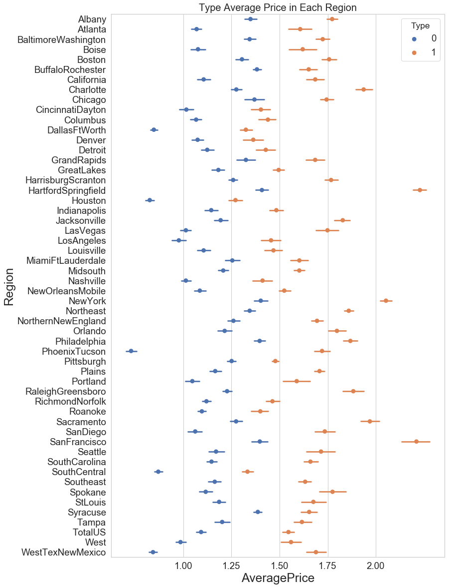
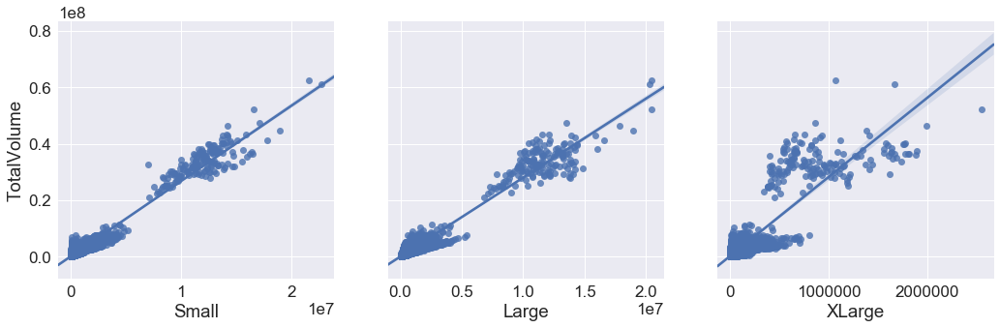
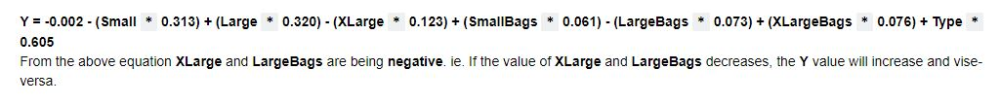

# Avocado-data-price-prediction

## Problem Statement:-
We're using the Avocado dataset from 2015, 2016, 2017, and 2018 to categorize Organic & Conventional Types and forecast the average price using a regression model.

Introduction
Avocado consumption data is included in the Avocado dataset, which spans the years 2015 to 2018. Avocados are offered in two varieties.

### 
Data
| COLUMN | DATA TYPES |
| --- | --- |
| `DATE`            |   OBJECT |
| `AVERAGEPRICE`    |   FLOAT64 | 
| `TOTALVOLUME`     |   FLOAT64 |
| `SMALL`           |   FLOAT64 |
| `LARGE`           |   FLOAT64 |
| `XLARGE`          |   FLOAT64 |
| `TOTALBAGS`       |   FLOAT64 |
| `SMALLBAGS`       |   FLOAT64 |
| `LARGEBAGS`       |   FLOAT64 |
| `XLARGEBAGS`      |   FLOAT64 |
| `TYPE`            |   OBJECT |
| `YEAR`            |   INT64 |
| `REGION`	         |   OBJECT |

<b>Observations</b> 
* TotalVolume vs Small and TotalBags vs SmallBags have a strong relationship. 
* TotalVolume vs XLarge and TotalBags vs. XLargeBags have a modest correlation. Large and LargeBags are in the middle of the pack.

<b>Conclusion</b> 
* When we analyze Small Hass in Small Bags, columns like Type of Avocado, Size, and Bags have an impact on Average Price. The __lower the RMSE value__, the more accurate the model is.
* For this dataset, the __Random forest Classifier__ has a higher accuracy than the __Logistic regression__ model (__accuracy is 0.99__). This could indicate that it is overfitting because it correctly classifies the outliers.
* The __Random forest classifier__ model is more accurate than the __Logistic regression__ model in predicting Avocado type.
* The __Random Forest Regressor__ model is more accurate than the __Linear regression__ model in predicting the average price.br>
[Notebook](AvocadoDataset.ipynb)

